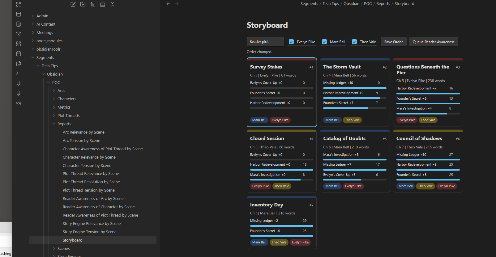

# Obsidian Tools

Tools for evaluating Obsidian scene notes, queueing batch work, and reviewing story structure through Dataview reports.

The evaluators work on **scenes**. Storyboard can group scenes into chapters for planning, but chapter blocks are a visual and writer-controlled organization layer over scene notes.

## Quick Start

From Obsidian, use these Templater templates:

- `Templates/Batch-Evaluate-Scenes.md`: queue the full scene evaluation batch.
- `Templates/Queue-Reader-Awareness.md`: rerun only Reader Awareness after changing scene order.
- `Templates/Start-Scheduler.md`: start a background scheduler worker.
- `Templates/Cancel-Batch-Evaluation.md`: cancel the latest queued or running job.

From a terminal in `obsidianTools`:

```sh
node scheduler/enqueue-batch.mjs "C:\Users\ian\writers\Segments\Tech Tips\Obsidian\POC\Scenes"
node scheduler/worker.mjs --drain
```

To enqueue only Reader Awareness:

```sh
node scheduler/enqueue-batch.mjs "C:\Users\ian\writers\Segments\Tech Tips\Obsidian\POC\Scenes" --preset reader-awareness
```

To process one scene directly:

```sh
node evaluators/evaluate-scene.mjs "C:\Users\ian\writers\Segments\Tech Tips\Obsidian\POC\Scenes\01 Inventory Day.md" "Tension" "Character"
```

## Scene Frontmatter

Scene notes are the canonical evaluated units. The evaluator expects scene frontmatter to include the relevant story lists:

```yaml
---
name: Inventory Day
type: Scene
chapter: 1
chapter_order: 1
scene_order: 1
pov: Mara Bell
characters:
  - Mara Bell
plotThreads:
  - Missing Ledger
storyEngines:
  - Mystery
arcs:
  - Professional Growth
---
```

`chapter_order` and `scene_order` are writer-authored structure fields. They are not AI-generated and do not belong under `ai`.

- `chapter_order`: the chapter's position in the book/story.
- `scene_order`: the scene's position inside that chapter.
- `chapter`: the chapter label or number used for grouping scenes.

Storyboard writes `chapter_order` and `scene_order` when you rearrange tiles and click `Save Order`.

## Storyboard

Open `Segments/Tech Tips/Obsidian/POC/Reports/Storyboard.md` in Obsidian.



Storyboard has two view modes:

- `Scenes`: a horizontal filmstrip of scene tiles.
- `Chapters`: chapter blocks containing nested scene rectangles.

The second selector controls the data lens:

- `Reader plot`: Reader Awareness for plot threads.
- `Reader character`: Reader Awareness for characters.
- `Reader arc`: Reader Awareness for arcs.
- `Story lists`: characters, plot threads, and arcs without Reader Awareness bars.

Character checkboxes filter the visible scenes. The checkbox colors match the Storyboard color language.

### Scene Tiles

Scene tiles are compact color blocks. Their width is based on scene word count. The color is based on POV.

Scene tiles show their order badge as:

```text
chapter_order.scene_order
```

Hovering, focusing, or selecting a scene reveals the tile's text and summary data. Hover also shows a larger card with Reader Awareness deltas, cumulative totals, and rationales.

Click a scene to open the scene detail pane. Double-click a scene to open the note.

### Chapter Blocks

Chapter mode groups scene notes by their `chapter` field.

Chapter order is controlled by `chapter_order`. Scene order inside a chapter is controlled by `scene_order`.

Chapter blocks show:

- a chapter order badge, such as `C1`
- nested mini scene rectangles in chapter order
- scene-order numbers inside those rectangles

Hover a chapter to see its scene list. Click a chapter to open the chapter detail pane. Click a mini scene rectangle to switch the detail pane to that scene.

### Saving Order

You can maintain order in two ways:

- Edit `chapter_order` and `scene_order` directly in scene frontmatter.
- Rearrange Storyboard tiles and click `Save Order`.

In `Scenes` mode, dragging scene tiles changes the scene sequence. In `Chapters` mode, dragging chapter blocks changes chapter order while preserving the scene order inside each chapter.

When saved, Storyboard updates scene frontmatter:

```yaml
chapter_order: 2
scene_order: 3
```

If `storyboardReaderAwarenessAfterReorder` is set to `ask` or `auto`, Storyboard can queue Reader Awareness after saving order. Reader Awareness is still evaluated on individual scenes.

## Reader Awareness

Reader Awareness is a delta score, not an absolute score.

For each scene, the evaluator asks: what does the reader newly learn in this scene, compared to prior scenes?

It supports three targets:

- `Reader Awareness / Character`: new reader knowledge about a character.
- `Reader Awareness / Plot Thread`: new reader knowledge about a plot thread.
- `Reader Awareness / Arc`: new visible evidence that an arc progressed, reversed, deepened, or resolved.

Scores are stored under scene frontmatter:

```yaml
ai:
  readerAwareness:
    plotThreads:
      Missing Ledger:
        delta: 7
        rationale: The scene reveals new evidence about where the ledger may have gone.
```

Storyboard calculates cumulative totals by summing deltas in story order. If you change order, rerun Reader Awareness so each scene's delta is calculated against the correct prior context.

## Reports

Reports live in `Segments/Tech Tips/Obsidian/POC/Reports`.

Most report pages use Dataview or DataviewJS to read scene frontmatter and render tables or charts. They do not run evaluations themselves.

Simple report categories:

- `Character Relevance/Tension by Scene`: how strongly each scene relates to or tensions a character.
- `Plot Thread Relevance/Tension/Resolution by Scene`: how scenes support, pressure, or resolve plot threads.
- `Story Engine Relevance/Tension by Scene`: how scenes support broad story engines such as mystery or institutional conflict.
- `Arc Relevance/Tension by Scene`: how scenes support or pressure arcs.
- `Character Awareness of Plot Thread by Scene`: what characters newly learn about plot threads.
- `Reader Awareness of Character/Plot Thread/Arc by Scene`: what the reader newly learns, shown as scene deltas and cumulative totals.
- `Storyboard`: the interactive planning surface for ordering scenes and chapters.

If a report is empty:

- Confirm the batch has run for that metric.
- Reopen the note or refresh Dataview.
- Confirm the Charts plugin is enabled for chart reports.
- Inspect the scene frontmatter under `ai` to confirm the expected data exists.

## Scheduler Modes

Scheduler behavior is controlled in `config.local.json`.

The config loader accepts JSON with comments, so `//` and `/* ... */` comments are allowed in `config.local.json` and `config.example.json`.

```json
{
  "scheduler": {
    "mode": "manual",
    "throttleMs": 5000,
    "pollIntervalMs": 30000,
    "launchWorkerFromTemplater": true,
    "monitorFromTemplater": true,
    "statusNoticeIntervalMs": 5000,
    "statusNoticeMaxMinutes": 240,
    "storyboardReaderAwarenessAfterReorder": "ask"
  }
}
```

`manual` mode is the default. Templater queues the batch and starts a worker that drains queued jobs, using `throttleMs` between evaluator calls.

`background` mode leaves the worker running separately. In this mode, Templater only queues jobs; the long-running worker picks them up on its next poll.

`statusNoticeIntervalMs` controls how often Obsidian checks the job file and shows progress notices. Set `monitorFromTemplater` to `false` if you only want logs and job files.

`storyboardReaderAwarenessAfterReorder` controls what Storyboard does after saving order:

- `manual`: save `chapter_order` and `scene_order` only.
- `ask`: ask whether to queue Reader Awareness.
- `auto`: queue Reader Awareness immediately.

Start the background worker from Obsidian with `Templates/Start-Scheduler.md`, or from a terminal:

```sh
node scheduler/worker.mjs --watch
```

Run one manual drain from a terminal:

```sh
node scheduler/worker.mjs --drain
```

Cancel the latest queued or running job from a terminal:

```sh
node scheduler/cancel-job.mjs --latest
```

## Batch Scene Evaluation

Use `Templates/Batch-Evaluate-Scenes.md` from any scene in the folder you want to process.

By default, the Templater script:

1. creates a queued batch job under `obsidianTools/.queue/jobs`
2. starts the scheduler worker in `--drain` mode
3. shows progress notices while the worker processes scenes in the background
4. returns control to Obsidian

The worker writes job logs to `obsidianTools/.queue/logs`.

Cancel a queued or running batch from Obsidian with `Templates/Cancel-Batch-Evaluation.md`. Running jobs stop before the next evaluator call. If cancellation arrives while one evaluator process is active, the worker stops that child process.

Run only Reader Awareness from Obsidian with `Templates/Queue-Reader-Awareness.md`. The full batch also includes Reader Awareness; this template is for targeted reruns after order changes.
